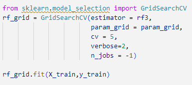

# Random-forest
understand basics of Random forest and with basic codes
Here hyperparameter is used to improve accuracy but nothing great achieved
firstly all the models tried with tuning

then tried with tuning with best parameters

where we can random forest without tuning was giving accuracy of 85% but with tuning accuracy shoot to 90%
